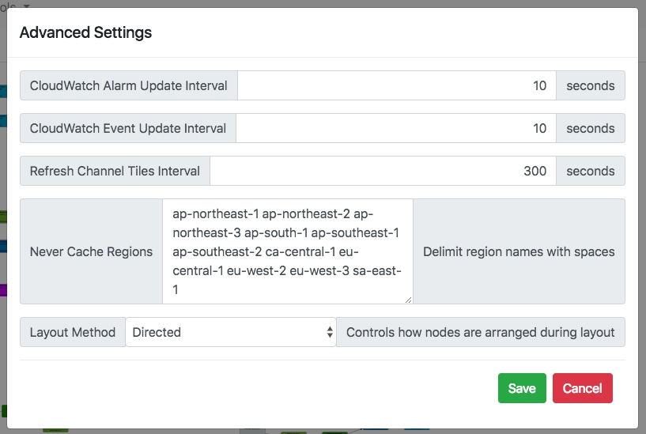
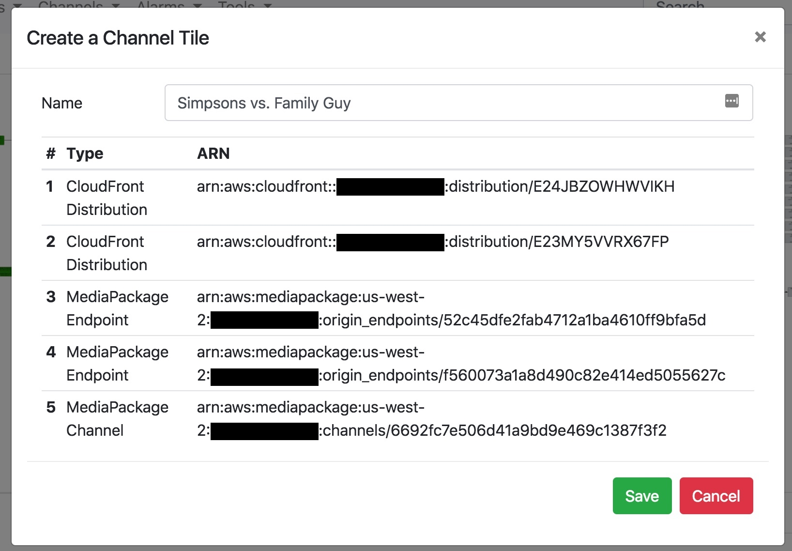
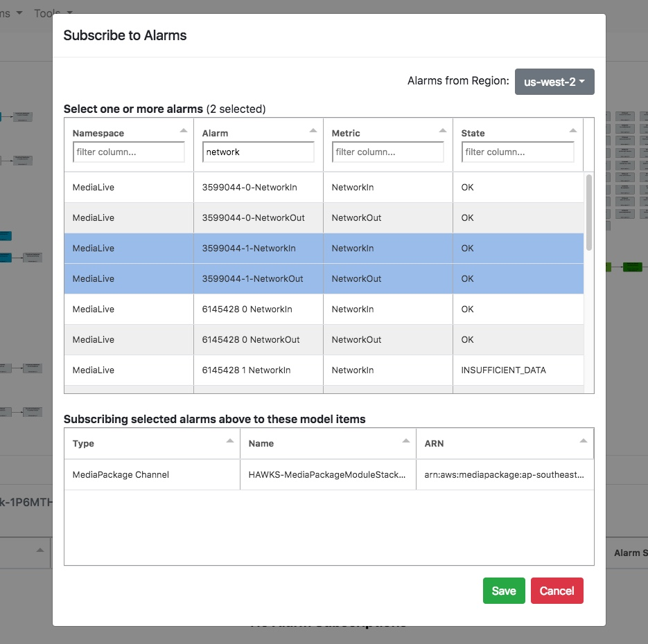

# MSAM Basic Usage

## First Run (Important)

Each time the MSAM web application is launched, the browser's locally stored cookies are checked for any previous API connection information. If a previous connection is found, it is used by the browser automatically on the next launch.

**Did you retrieve the default API key in the installation instructions?** If not, go back to [Install](INSTALL.md) and review *Retrieve the Authentication Key for the REST API.*

When MSAM starts and a previous connection is not found, the user is prompted for an endpoint URL and API key. The tool will confirm the connection information is valid before continuing. You can save several endpoints in browser storage for easy reuse later.

Toggle the **Remember** button on the Connection dialog to store the endpoint and API key for recall after the browser is closed. Remembered endpoints and API keys will remain for up to seven days without use before they are removed. Using an endpoint will reset its expiration timer. Select **Do Not Remember** to use this endpoint and API key only during the current browser session. Quittng the browser will cause the endpoint and API key to be forgotten.

API keys are created and removed from the API Gateway page in the AWS Console. An API key is still active until it is removed from API Gateway.

The browser application checks the settings in the cloud for  regions displayed on the diagram after it has connected with the API. The tool will prompt the user to choose regions to display if none have been previously selected.

Watch the status view at the bottom of the page as the tool loads content from the cloud. The tool will gather the elements into the center of the page for resources without any previous layout information. It can look like a big mess, but we have tools to help organize it.

To perform a coarse layout, select the Nodes menu and Layout Vertical. This will create a simple top-down hierarchical layout of each of the groups of connected resources. The positions of items on the diagram are automatically saved to the cloud a few seconds after moving.

Please continue reading about the Global Model, Navigation, Selection and Layout to understand how to customize the organization the global model.

## Data Freshness

The MSAM browser application doesn't automatically pull in new nodes that are discovered while it's running. This feature may be added in a future release. For now, you can refresh the browser page to retrieve the latest nodes and connections from the cloud cache. The diagram layout and other settings will be restored.

## Global Model

The global model tab represents all of the cloud resources for the chosen regions that were loaded into the browser application. There may be more resources in same AWS account located in regions not loaded into the application.

### Navigation

* Fit, zoom and movement buttons are located at the bottom corners of the diagram
* Left-mouse-click and drag the background of the diagram to reposition
* Double-click a node to zoom in to it

### Selection

* Selection notifications are shown toward the right of the navigation bar
* Select a single node by left-clicking it once
* Use the Command/Ctrl keys with left-click to select multiple items
* Drag with the right button to select a group of items on the diagram

After selecting an item on the diagram, click the **Selected Item** tab in the lower part of the screen. This tab shows the top-level AWS service configuration of the item in JSON format.

### Nodes and Connections

Any node on the diagram can be dragged to a new position. Use the layout tools described below to help select and organize the nodes in a way that makes sense for your environment.

A typical process for diagram layout involves:

1. Perform a vertical or horizontal layout of the entire diagram
2. Organize the hierarchical groups on the diagram surface using various selection tools and dragging the groups nearby
3. Use the Fit button (bottom-right corner) periodically to zoom out and see everything
4. After using the Fit button, you may need to zoom back in to an area to select and move a group of nodes closer together

## Menus

* Settings
    * Connection Settings
    * Regions Displayed
    * Advanced Settings
    	* CloudWatch Alarm Update Interval -- query the REST API for alarm changes at this internal
    	* CloudWatch Event Update Interval -- query the REST API for event changes at this internal
    	* Refresh Channel Tiles Interval -- query the REST API for new channel tiles at this interval
    	* Never Cache Regions -- a list of regions to never inventory in the cloud
    	* Layout Method -- affects how diagram nodes are arranged during horizontal or vertical layout (default is **Directed**)

* Nodes 
    * Expand Selection to All Upstream/Downstream -- expands the selection of nodes in the direction of connections. Downstream recursively selects nodes with arrows pointing away from the selected node. Upstream recursively selects nodes with arrows pointing to the selected node.
    * Align Selected Vertically/Horizontally -- aligns the selected nodes along the chosen path. This tool will find the average X or Y position of the selected nodes and align all nodes to that value.
    * Layout Vertical/Horizontal -- performs a rough layout of all nodes on the diagram using a top-down or left-right hierarchical method. There is usually space left between groups of nodes, so consider using one of the multiselect capabilities to move groupings together on the diagram.
    * Layout Isolated Nodes -- performs a box layout of the same types of nodes without any connections. This layout is called at the end of Layout Vertical/Horizontal.
    * Save Entire Layout Now -- save the position of all nodes. When nodes are moved, the new positions are recorded automatically after a few seconds. This is a manual operation on all the diagram items that records the positions immediately. **This operation may cause your layout table in DynamoDB to scale-up in capacity units temporarily if you are working with a large inventory of diagram items.**

* Channels
    * Create New Channel Tile -- see below. One or more diagram nodes are selected before choosing this menu item. This operation will prompt the user for a channel tile name with the selected nodes. After providing the name and clicking Save, the tile will appear in the Channel Tiles tab.
    * Add to Existing Channel Tile -- One or more diagram nodes are selected before choosing this menu item. This operation will display a dialog with existing channel tiles and the currently selected nodes. After select one or more existing tiles and clicking Save, the tiles will update in the Channel Tiles tab.

* Alarms
    * Subscribe to Alarms -- see below. One or more diagram nodes are selected before choosing this menu item. This operation will prompt the user to find and select one or more CloudWatch alarms to associate to the selected nodes. Any alarms can be subscribed to any nodes. The association exists only within MSAM.

* Tools -- tools are extensions that provide some type of functionality. Custom tools can be built and added to MSAM, and invoked from this menu.

## Channel Tiles

A channel tile represents all of the cloud resources that make up a broadcast or live streaming channel. A channel tile might include, for example, an AWS MediaLive input and channel, MediaPackage channel and endpoints, SPEKE keyserver, and CloudFront distribution. A cloud resource can be a member of more than one channel tile, such as an S3 bucket or CloudFront distribution. The alerts and alarms of a channel tile's resources are aggregated and communicated by visual indications on the tile.

Tiles are sorted by the total number of alarms and alerts, and then by tile name. Diagram nodes are peridically updated to visually reflect the state of subscribed alarms and alerts. Channel tiles reflect the aggregate status of all diagram nodes associated with the tile. 

### Creating a Tile

A channel tile is created from the Global Model. 

1. Select one or more nodes on the diagram using any of the methods discussed above
1. Select the Channels menu, Create New Channel Tile menu item
1. Review the cloud resources previously selected
1. Provide a name for the new tile and click the Save button

The new tile will appear in the Channel Tile view. Tiles will automatically update every few seconds to show the latest status.

### Selecting a Tile

Select a tile by clicking the upper area where the name is displayed. The **Selected Item** tab will show the aggregate information for all resources included in the tile.

## Searching for Resources and Tiles

Search controls are located at the upper right of the page. Both views are searched simultaneously. Search results are displayed in the **Search** tab at the lower part of the page. Search results are updated as you type.

Global Model and Tile search results are shown in separate compartments in the **Search** tab. Clicking search results will navigate to that item in either view.

Toggling the **Only Show Matches** button will filter all other items from the view except those in the search results. The **Clear** button will clear and reset the search controls and views.

## Monitoring Cloud Resources

Select any item in the **Global Model** or **Channel Tiles view**. Click the **Monitor** tab to view the subscribed CloudWatch Alarms and MediaLive pipeline alerts.

### Cloudwatch Alarms

MSAM can associate any CloudWatch alarm to any node on the diagram. 

1. Select one or more items in the Global Model
1. Select the Alarms menu and Subscribe to Alarms menu item
1. Use the region list and column filters, and select one or more CloudWatch alarms
1. Click Save

After a diagram node is subscribed to an alarm:

1. Select one of the diagram nodes or select a tile associated with a node
1. Select the Monitor tab

The upper area of the Monitor tab contains subscribed alarms and the lower area contains MediaLive alerts. The diagram item and any associated channel tiles will show a state change of any subscribed alarms.

### AWS MediaLive Alerts

Install the msam-events CloudFormation template in the same region as the AWS MediaLive channels. Alerts will be automatically received into the application and indicated on the diagram as they are set and cleared.

## Navigate

Navigate to [README](README.md) | [Workshop](WORKSHOP.md) | [Install](INSTALL.md) | [Usage](USAGE.md) | [Uninstall](UNINSTALL.md)
